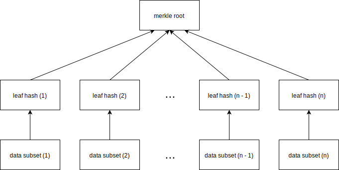

# Table of Contents

- [Table of Contents](#table-of-contents)
    - [Introduction](#introduction)
        - [Data attachment](#data-attachment)
    - [Possible Use Cases](#possible-use-cases)

## Introduction

The Claim extension enable the possibility of creating [verifiable claims](https://docs.microsoft.com/en-us/previous-versions/msp-n-p/ff359101(v=pandp.10)?redirectedfrom=MSDN), backed by trusted authorities, and therefore to fully authenticate an entity to a third party. It furthermore lets an entity share pieces of attested user data in a way that the verify is able to validate these pieces without knowing the whole data set. 

A blockchain based identity system could be build
based on the Attestation Protocol combined with this extension.

### Data attachment

To protect privacy and shrink the size of attached data, the attached entity data will not be set in clear text. Only the fingerprint (hash) of a data set will be public available and stored on the blockchain. 

To achieve this, an authority first creates a [merkle tree](https://en.wikipedia.org/wiki/Merkle_tree) based on the entity data and attaches the merkle root as a proof to the entity identifier by setting the merkle root as payload in the attestation process (see [Attestation Protocol](./Attestation-Protocol) page). To ease the creation of the merkle tree, a tree structure with an order of n and a depth of 2 should be used:

*merkle tree based on user data with order n and depth 2*

Whenever an entity wants to verify itself, it shares the requested data subset as clear text to the verifier including the necessary leaf hashes to recreate the merkle tree. 

The verifier then recreates the merkle tree and compares the merkle roots to verify the validity of the shared data.

To prevent an attacker from recreating the merkle root based on self collected user data (even though this wouldn't be very harmful), every data subset should be append with a nonce so that two identical data sets lead to two different leaf hashes and in the end to different merkle roots.

## Possible Use Cases

Because such an identifier, in the end, is an ordinary [asymmetric key pair](https://en.wikipedia.org/wiki/Public-key_cryptography), an entity can do all the things an asymmetric key pair provides, like encrypting messages, signing documents or authentication. 

- An entity could for example create its **own PKI** with the identifier acting as a root certificate and then has a system where even the trust root can be verified and validated.

- One could **sign documents** for ones customer where a third party can validate and verify that these documents are signed by this specific user.

- A **login system**, similar to [Facebook](https://developers.facebook.com/docs/facebook-login/) or [Google](https://developers.google.com/identity/sign-in/web/sign-in) Login could be developed where an entity can easily login with its identifier without revealing its private data and relying on a centralized infrastructure.
