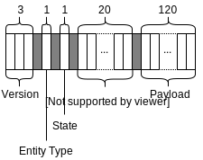

<!-- 
/*
 *  Copyright (C) 2019  Attila Aldemir <a_aldemir@hotmail.de>
 *
 *  This program is free software: you can redistribute it and/or modify
 *  it under the terms of the GNU General Public License as published by
 *  the Free Software Foundation, either version 3 of the License, or
 *  (at your option) any later version.
 *
 *  This program is distributed in the hope that it will be useful,
 *  but WITHOUT ANY WARRANTY; without even the implied warranty of
 *  MERCHANTABILITY or FITNESS FOR A PARTICULAR PURPOSE.  See the
 *  GNU General Public License for more details.
 *
 *  You should have received a copy of the GNU General Public License
 *  along with this program.  If not, see <https://www.gnu.org/licenses/>.
 */ 
 -->

# Table of Contents

- [Table of Contents](#table-of-contents)
- [Protocol Version](#protocol-version)
- [Introduction](#introduction)
- [Protocol Data Fields](#protocol-data-fields)
    - [Attestation Context](#attestation-context)
    - [Data Field Concatenation](#data-field-concatenation)
    - [Version](#version)
    - [Entity Type](#entity-type)
    - [State](#state)
    - [Redirect Account](#redirect-account)
    - [Payload](#payload)
    - [Misc](#misc)
- [Self-Attestation](#self-attestation)
- [Attestation](#attestation)
- [Data Signing](#data-signing)
- [Verification](#verification)

# Protocol Version

current version: 2.0.0

# Introduction

The following protocol describes a PKI-like system where chains of trust (so-called trust chains) can be built and managed via blockchain addresses.

After a trust chain is built, users can sign verifiable data that can later be verified in terms of integrity and authenticity. A third party is able to verify those data without needing to participate in a trust chain in any way.

The Attestation Protocol relies on blockchain infrastructure to benefit from an immutable, decentralized, and highly redundant history. This leads to credible and highly accessible trust chains.

<!-- The following criteria should be fulfilled:
1. based on asymmetric cryptography
2. data signing/verification
3. account attestation creation/revocation
4. different attestation roles -->

The [Ardor](https://ardorplatform.org) blockchain has been chosen as infrastructure blockchain due to its well-fitting [account properties](https://ardordocs.jelurida.com/Account_Properties) feature. It provides the possibility to tag an account with a small amount of data (160 characters).

In Ardor, the public available blockchain addresses are transformed to [Reed Solomon](https://ardordocs.jelurida.com/RS_Address_Format) human-readable strings and represented as accounts.

One advantage of the account properties feature is the capability of updating and deleting properties without losing history. Only the setter and receiver of a property are able to manipulate (update) it. If the setter and receiver differ, the receiver is only allowed to delete its account property.

The ability to self sovereignly delete properties can later be used as a kind of emergency switch in case of key theft. The owner of a compromised account can delete one's account property, which leads to a break in the trust chain and to an unsuccessful verification process.

The attestation protocol itself lives in the tagged data of an account property.

# Protocol Data Fields

Since the attestation protocol utilizes the account property feature, most of its data fields are embedded into the *value* key/value pair of a property. In Ardor, an account property is represented as a JSON object with at least a *property* and a *value* key/value pair.

## Attestation Context

The only data field not embedded into the *value* key/value pair, used to determine the context of an attested trust chain, is the **Attestation Context**. It represents the value of the *property* key/value pair and is used to provide the opportunity of attaching multiple trust chains to one account. To indicate that a property is part of the attestation protocol, the property value starts with the identifier *ap://*.

## Data Field Concatenation

All other fields are embedded into the 160 characters long *value* key/value pair. They consist of one or more characters concatenated into a defined order and separated by a pipe character ( | ).

*character arrangement of attestation protocols data fields*

## Version

The **Version** field points to the Attestation Protocol version. It is a three character long string with a character range of *0123456789abcdefghijklmnopqrstuvwxyzABCDEFGHIJKLMNOPQRSTUVWXYZ* (similar to [Base62](https://www.wikidata.org/wiki/Q809817)). Each character represents the corresponding [semantic version](https://semver.org) field. 

For example: String 200 points to the version 2.0.0 and 2aA to version 2.10.36

## Entity Type

The **Entity Type** character is used to define a type (role) of an entity inside a trust chain. There are three major types:

The **root** entity type is the trust anchor of a trust chain. It is similar to the [root certificate](https://en.wikipedia.org/wiki/Root_certificate) in a PKI and is allowed to attest itself, intermediates, and leaf entities. A verifier, in the end, needs to trust the root entity to verify a trust chain positively. It is the top end of a trust chain.

An **intermediate** is similar to a regular [certificate authority](https://en.wikipedia.org/wiki/Certificate_authority) in a PKI. It is attested by a root or another intermediate account and can attest other intermediate and leaf entities. It acts as an intermediate chain link in a trust chain.

A **leaf** entity is the bottom end of a trust chain. It is not allowed to attest any kind of entities and, therefore, to add links to a trust chain.

With this approach, trust chains can be built with high flexibility.

*trust chain overview*

The following table shows the entity type characters used to represent the entity types:

| Entity Type  | Entity Type Character | Brief                                                                                                                        |
|--------------|:---------------------:|------------------------------------------------------------------------------------------------------------------------------|
| root         |           r           | Is the trust anchor in a trust chain; Can attest intermediates and leaf accounts; Like a root CA in a PKI |
| intermediate |           i           | Can attest other intermediates and leaf accounts; Like a regular CA in a PKI                                          |
| leaf         |           l           | Is not allowed to add any member to the trust chain; Like an end-entity in a PKI                                     |

*entity type character table*

## State

The **State** data field indicates the current state of an account. There are three state types:

An **active** account is an account that is used and activated. It is a valid part of the current trust chain.

An **inactive** account was active in the past and is now inactive. It is no longer a valid part of a trust chain but can be reactivated.

A **deprecated** account was used in the past, and the account holder has moved to another account. One's new account is referenced in the redirect account data field of the previous account. This state is especially useful for intermediate and root entities as it does not break the trust chain in the future.

A short example: An intermediate account holder attests a leaf account and later moves to another account. The leaf account holder creates a claim, signs it with its leaf account, and shares the claim with a verifier later on. The verifier verifies the trust chain starting from the leaf account and moves one level up to the intermediate account. If the intermediate account had been marked as inactive (since the account holder moved to another account), the trust chain would end here, and the verifier would verify the claim as not trustworthy.

However, because the intermediate account is marked as deprecated and the new account is included in the redirect data field, the verifier is able to continue parsing the trust chain. To do so, one follows the redirecting accounts repetitively until reaching an active account and continues the verification process. With this approach, even multiple account switching would not break the trust chain because the next account is always included in the redirect data field of the previous account.

The following table shows the state characters used to represent the state:

| State | State Character | Brief                                                               |
|------------|:--------------------:|---------------------------------------------------------------------|
| active     |           a          | Account is a valid part of the trust chain                          |
| inactive   |           i          | Account is an invalid part of the trust chain                       |
| deprecated |           d          | Account is invalid, but a new account was created and referenced |

## Redirect Account

As explained in the state type section, the **Redirect Account** data field is only used in case of a deprecated state. It points to the account that took over the current account. To save character space, not the complete Reed Solomon account representation is included in the data field. Only the significant 20 characters without the *ARDOR-* prefix are stored. To use the redirecting account, one needs to reconstruct the Reed Solomon representation later on. In case the data field is not used, it has the dummy value of *0000-0000-0000-00000*.

## Payload

The **Payload** is a free text field with a length of 120 characters. In most cases, it should be filled with information related to the property account holder or hashes representing the fingerprint of those data.

If 120 characters are not suitable, one could create another transaction, including the required data, and store the transaction hash in the payload field. With this approach, the data are immutably linked to the account, too.

## Misc

It should be mentioned that not all 160 characters are used within the protocol. Only 149 characters are occupied: 3 (version) + 1 (entity type) + 1 (state type) + 20 (redirect account) + 120 (payload) + 4 (delimiter). The missing 11 characters are reserved for future protocol extensions.

The next sections describe the workflows to create, attest, update, delete, and verify accounts.

# Self-Attestation

*self-attestation overview*

First of all, there has to be a root account. A root account, as explained above, is a self-attested account and, therefore, must have a self-set account property. The property object contains the Attestation Context as *property* value and the concatenated data fields as *value* value. The Version variable is set to 200, as this indicates the version of the Attestation Protocol. The entity type variable is set to the character 'r' and represents a root entity. The following 'a' character sets the root entity to active and therefore the redirecting account variable to the dummy value of '0000-0000-0000-00000'. The next 120 characters are assigned to the user payload.

If a root account holder decides to deactivate one's account, one needs to update the state type character to 'i'. This account will then be treated falsy in the verification process. To revoke one's decision and reactivate the account, one needs to switch the state type character to 'a' again.

To update the account payload, one updates the existing account property with the updated payload.

Moving to another account requires a little more complexity. A root account holder first needs to again self-attest the new account in the same way previously described and additionally link the old account to the new one. The linking is done by setting the state type character to 'd', which stands for deprecated, and updating the redirecting account to the new self-attested account. The link lets the trust chain continue so that it can be successfully parsed in the verification process (see deprecation state description for a more detailed explanation).

To revoke the complete attestation and, therefore, opt-out from the trust chain, one only needs to delete one's account property.

# Attestation

*attestation overview*

Since the self-attestation workflow is derived from the attestation workflow, the attestation workflow works in principle the same way. The big difference is the setter account of an account property (which is the attestation). Every attestation has to be set by a trustworthy entity of a trust chain with permission to attest other accounts. A trustworthy entity is an already attested account and the root account.

Because the leaf account is not allowed to attest any account, only the root or an already attested intermediate account (attestor) can attest another account (attested account).

It should also be mentioned that there is the capability of self-sovereignty revoking an attestation.

# Data Signing

*data signing overview*

After a trust chain is built, an attested account holder is able to sign data. The authenticity of these data can later be verified without needing to participate in a trust chain in any way. Only the root account must be known and trusted.

To do so, the attested account holder creates a signature token based on the signed data object properties. These properties consist of a payload (the actual data to be verified), the attestation context, the attestation path (which is the path from the attestor account up to the root account), and the attested account itself as creator account.

Even though the creator account property is not necessarily needed for verification (because the signature token already includes this information), it should nevertheless be part of a signed data object. The reason is human readability. One should be able to see the origin of signed data without needing to go through the verification process.
 

# Verification

*verification workflow*

Whenever a verifier receives a signed data object, the following steps must be successfully performed to verify the validity of this data.

1. decode the signature token.
2. verify the validity of that token.
3. check if the signature creator account is the same as the creator account specified in the signed data.
4. check the signed data (optional)
5. collect the data fields of the creator account (based on the attestation context).
6. check the formal validity of the data fields.
7. check the attested account data fields (optional)
8. check if the attested account is the signed data creator account
    1. if it is the signed data creator account
        1. check if the attested account is in state active.
        2. continue with 9.
    2. if it is not the signed data creator account
        1. follow the deprecation path until an attested account is found that is not deprecated.
            1. collect the concatenated data fields of the referenced attested account (based on the attestation context and redirect account).
            2. check the formal validity of the data fields.
            3. check if the redirecting account has the same entity type as the original account
            4. check the referenced attested account data fields (optional)
            5. treat the referenced attested account as an attested account
            6. continue with step 8.2.1.
        2. check if the attested account is in state active. 
        3. continue with 9.
9. check the entity type of the attested account.
    1. If it is a root account
        1. decide if it is trustworthy and known.
        2. check if the account property was self-set.
        3. stop the verification process successfully.
    2. If it is not a root account
        1. check if the attested account is the signed data creator account
            1. if it is the signed data creator account
                1. continue with step 10.
            2. if it is not the signed data creator account
                1. check if the entity type is not a leaf.
                2. continue with step 10.
10. collect the data fields from the attestor account.
11. treat the attestor as an attested account.
12. continue with step 6.
