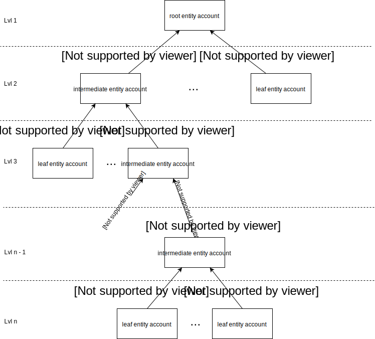

<!-- 
/*
 *  Copyright (C) 2019  Attila Aldemir <a_aldemir@hotmail.de>
 *
 *  This program is free software: you can redistribute it and/or modify
 *  it under the terms of the GNU General Public License as published by
 *  the Free Software Foundation, either version 3 of the License, or
 *  (at your option) any later version.
 *
 *  This program is distributed in the hope that it will be useful,
 *  but WITHOUT ANY WARRANTY; without even the implied warranty of
 *  MERCHANTABILITY or FITNESS FOR A PARTICULAR PURPOSE.  See the
 *  GNU General Public License for more details.
 *
 *  You should have received a copy of the GNU General Public License
 *  along with this program.  If not, see <https://www.gnu.org/licenses/>.
 */ 
 -->

# Table of Contents
- [Table of Contents](#table-of-contents)
- [Protocol Version](#protocol-version)
- [Introduction](#introduction)
- [Protocol Data Fields](#protocol-data-fields)
    - [Attestation Context](#attestation-context)
    - [Data Field Concatenation](#data-field-concatenation)
    - [Version](#version)
    - [Entity Type](#entity-type)
    - [State](#state)
    - [Redirect Account](#redirect-account)
    - [Payload](#payload)
    - [Misc](#misc)
- [Self Attestation](#self-attestation)
- [Attestation](#attestation)
- [Data Signing](#data-signing)
- [Data Verification](#data-verification)
- [Future Work](#future-work)
    - [Document Signing](#document-signing)
    - [Entity Ranking](#entity-ranking)
    - [Validity Timeout](#validity-timeout)

# Protocol Version

current version: 1.0.0

# Introduction

The following protocol describes a [PKI](https://www.bsi.bund.de/EN/Topics/ElectrIDDocuments/securPKI/pki_node.html) like system where chains of trust (so called trust chains) can be build and managed via blockchain addresses.

After a trust chain is build, authenticated claims can be created by participating users and the authenticity can be verified by third parties.

The attestation protocol should be build on top of a blockchain infrastructure to benefit from an immutable, decentralized and highly redundant history which leads to highly credible and available trust chains.

The following criteria should be fulfilled:
1. based on asymmetric cryptography
2. data signing / verification
3. create / revoke attestations
4. attesting other accounts
5. different attestation roles

The [Ardor](https://ardorplatform.org) blockchain has been chosen as infrastructure blockchain due to its well fitting [account properties](https://ardordocs.jelurida.com/Account_Properties) feature. It provides the possibility to tag an account with a small amount of data (160 characters).

In Ardor, the public available blockchain addresses are transformed to [Reed Solomon](https://ardordocs.jelurida.com/RS_Address_Format) human readable strings and represented as accounts.

A big advantage of the account properties feature is the capability of updating and deleting an account property (without losing the history) along to the fact that only the setter and receiver of such a property is able to manipulate (update) it. If the setter and receiver differs, the receiver is only allowed to delete its account property.

The ability to self sovereignly delete account properties can later be used as a kind of emergency switch in case of key theft. The owner of a compromised account can delete ones account property, which then leads to a break in the trust chain and in the end to an unsuccessful verification process.

Even if the Ardor blockchain along with its account properties feature is a well fitting host system, it should be mentioned that the attestation protocol could be ported to other blockchains, too. 

The attestation protocol itself lives in the tagged data of an account property.

# Protocol Data Fields

Due to the fact that the attestation protocol is embedded into the account property feature, most of its data fields are embedded into the *value* key/value pair of an account property. In Ardor, an account property is represented as a JSON object with at least a *property* and  a *value* key/value pair. 

## Attestation Context

The only data field that is not embedded into the *value* property, used to distinguish the context of an attested trust chain, is the **Attestation Context**. It represents the value of the *property* key/value pair and is used to enable the possibility of attaching multiple trust chains to one account. To indicate that a property is part of the attestation protocol, the property value should start with the identifier *ap://*.

## Data Field Concatenation

All other fields are embedded into the 160 character long *value* key/value pair. They consists of one or more characters concatenated in a defined order and separated by a pipe character ( | ).

*character arrangement of attestation protocols data fields*

## Version

The **Version** field indicates the attestation protocol version. It is a three digit number starting at 001 and needs to be incremented whenever a protocol update was made. The current version number is 001.

## Entity Type

The **Entity Type** character is used to define the type (role) of an entity inside the trust chain. There are three major types:

The **root** entity type is a special attestor type and the trust anchor of a trust chain. It is similar to the [root certificate](https://en.wikipedia.org/wiki/Root_certificate) in a PKI and is allowed to attest itself, intermediates and leaf entities. A verifier in the end needs to trust the root entity of a trust chain to verify the chain in a positive way. It is the top end of a trust chain.

An **intermediate** is similar to a normal [certificate authority](https://en.wikipedia.org/wiki/Certificate_authority) in a PKI. It is attested by the root or another intermediate account and is able to attest other intermediates and leaf entities. It acts as an intermediate chain link in a trust chain.

A **leaf** entity is the bottom end of a trust chain. It is not allowed to attest any entities and therefore to add links to a trust chain.

With this approach, trust chains can be build with high flexibility.

*trust chain overview*

The following table shows the entity type character that are used to represent the entity types:

| Entity Type  | Entity Type Character | Brief                                                                                                                        |
|--------------|:---------------------:|------------------------------------------------------------------------------------------------------------------------------|
| root         |           r           | It is the ultimate trust anchor in a trust chain; Can attest intermediates and leaf accounts; Like a root CA in a PKI |
| intermediate |           i           | It can attest other intermediates and leaf accounts; Like a normal CA in a PKI                                          |
| leaf         |           l           | It is not allowed to add any member to the trust chain; Like an end-entity in a PKI                                     |

*entity type character table*

## State

The **State** data field indicates the current state of an account. There are three state types:

An **active** account is an account that is used and activated. It is a valid part of the current trust chain.

An **inactive** account is an account that was active in the past and is inactive now. It is not a valid part of a trust chain at the current time, but can be reactivated later.

A **deprecated** account is an account that was used in the past and the account holder has now moved to another account. Ones new account is then referenced in the redirect account data field of the original account. This is especially useful for intermediate and root entities as it doesn't break the trust chain in the future.

A short example: An intermediate account holder attests a leaf account and then moves to another account. The leaf account holder later creates a claim, signs it with its leaf account and shares the claim with a verifier. The verifier then verifies the trust chain starting from the leaf account and moves one level up to the intermediate account. If the intermediate account would have been marked as inactive (because the account holder moved to another account), the trust chain would end here and the verifier would mark the claim as not trustworthy. 

Since the intermediate account is marked as deprecated and the new account is included in the redirect data field, the verifier can go on and continue verifying the trust chain by following the redirect account up to the root account. With this approach, even multiple account switching wouldn't break the trust chain because the next account is always included in the redirect data field of the previous account.

The following table shows the state character that are used to represent the state:

| State | State Character | Brief                                                               |
|------------|:--------------------:|---------------------------------------------------------------------|
| active     |           a          | Account is a valid part of the trust chain                          |
| inactive   |           i          | Account is an invalid part of the trust chain                       |
| deprecated |           d          | Account is invalid, but a new account was created and is referenced |

## Redirect Account

As explained in the state type section, the **Redirect Account** data field is only used in case of a deprecated state. It then points to the account that took over the actual account. To save character space, not the complete Reed Solomon account representation is included in the data field. Only the significant 20 characters without the *ARDOR-* prefix are stored here. To use the redirect account, the Reed Solomon representation needs to be reconstructed later on. In case the data field is not used, it has the dummy value of *0000-0000-0000-00000*.

## Payload

The **Payload** is a free text field with a length of 120 characters. In most cases it should be filled with information related to the property account holder and / or hashes representing the fingerprint of those data.

In case 120 characters are not enough, one could create another transaction including the required data and store the transaction hash in the payload field. With this approach, the data are immutable linked to the account, too.

## Misc

It should be mentioned that not all 160 characters are used within the protocol. Only 149 characters are used: 3 (version) + 1 (entity type) + 1 (state type) + 20 (redirect account) + 120 (payload) + 4 (delimiter). 11 characters are reserved for future protocol extensions.

The next sections describe the workflows to create, attest, update, delete and verify accounts.

# Self Attestation

*self attestation overview*

First of all there has to be a root account. A root account, as explained above, is a self attested account and therefore must have a self set account property. The property object contains the Attestation Context as *property* value and the concatenated data fields as *value* value. The Version variable is set to 001 as this indicates the first version of the Attestation Protocol. The entity type variable is set to the character 'r' and represents a root entity. The following 'a' character sets the root entity to active and therefore the redirect account variable to the dummy value of '0000-0000-0000-00000'. The next 120 characters are assigned to the user payload as explained above.

If a root account holder decides to deactivate ones account, One needs to update the state type character to 'i'. This account will then be treated falsy in the verification process. To revoke ones decision and reactivate the account, one needs to switch the state type character to 'a' again.

To update the account payload, one updates the existing account property with the updated payload.

For moving to another account, a little more complexity is required. A root account holder first needs to again self attest the new account in the same way as described above and additionally link the old account to the new one. This is done by setting the state type character to 'd', which stands for deprecated, and updating the redirect account to the new self attested account. This link lets the trust chain continue so that it can be successfully parsed in the verification process (see deprecation state description for a more detailed explanation).

To revoke the whole attestation and therefore opt out from the trust chain, one only needs to delete ones account property.

# Attestation

*attestation overview*

Due to the fact that the self attestation workflow is derived from the attestation workflow, the attestation workflow works in principle the same way as the self attestation workflow. The big difference is the setter account of an account property (which is basically the attestation). Every attestation has to be set by a trustworthy entity of a trust chain with the permission to attest other accounts. A trustworthy entity is an already attested account and the root account.

Because the leaf account is not allowed to attest other accounts, only the root or an already attested intermediate account (attestor) is able to attest other accounts (attested account).

It should also be mentioned that there is the capability of revoking an attestation self sovereignly.

# Data Signing

*data signing overview*

After a trust chain is build, an attested account holder is able to sign data. The authenticity of these data can later be verified without needing to participate in a trust chain in any way. Only the root account must be known and trusted.

To do so, the attested account holder creates a signature token based on the signed data object properties: a payload (the actual data to be verified), the attestation context, the attestation path (which is the path from the attestor account up to the root account) and the attested account itself as creator account. 

Even though the creatorAccount property isn't necessary needed for verification (because the signature token already includes this information), it should nevertheless be part of a signed data object. The reason is human readability. One should be able to see the origin of signed data without needing to actually verify it.
 

# Data Verification

*signed data verification workflow*

Whenever a verifier receives a signed data object, one needs to proceed the following steps successfully to verify the validity of these data.

1. decode the signature token.
2. verify the validity of that token.
3. check if the signature creator account is the same as the creator account specified in the signed data.
4. check the signed data (optional)
5. collect the data fields of the creator account (based on the attestation context).
6. check the formal validity of the data fields.
7. check the attested account data fields (optional)
8. check if the attested account is the signed data creator account
    1. if it's the signed data creator account
        1. check if the attested account is in state active.
        2. continue with 9.
    2. if it's not the signed data creator account
        1. follow the deprecation path until an attested account is found that is not deprecated.
            1. collect the concatenated data fields of the referenced attested account (based on the attestation context and redirect account).
            2. check the formal validity of the data fields.
            3. check if the redirect account has the same entity type as the origin account
            4. check the referenced attested account data fields (optional)
            5. treat the referenced attested account as attested account
            6. continue with step 8.2.1.
        2. check if the attested account is in state active. 
        3. continue with 9.
9. check the entity type of the attested account.
    1. If it is a root account
        1. decide if its trustworthy and known.
        2. check if the account property was self set.
        3. stop the verification process successfully.
    2. If its not a root account
        1. check if the attested account is the signed data creator account
            1. if it's the signed data creator account
                1. continue with step 10.
            2. if it's not the signed data creator account
                1. check if the entity type is not leaf.
                2. continue with step 10.
10. collect the data fields from the attestor account.
11. treat attestor as attested account.
12. continue with step 6.

# Future Work

## Document Signing

The Attestation Protocol needs to be adapted / expanded to verify documents attested in the past. The problem is the timestamp of the document signature (the token). Because the user self creates the token, one could fake the timestamp and therefore fake the token creation time. If for example a leaf account was active from time x to y, the owner of that account could sign a document after time y and fake the timestamp to be between x and y. This is not detectable.

It is not relevant for a login or authentication system, because the verifier checks the time span between token creation and current time. If this time span is to big, one would validate the token creation as false and therefore stop the verification process.

To solve this issue, a trustworthy entity or the verifier itself would need to additionally sign the token created by an attested account or create and sign the timestamp itself. This signature would then fix the timestamp and a change would break the signature and lead to an error in the verification process.

## Entity Ranking

The three entity types could be expand with subtypes to rank entities trustworthiness. For example, a governmental intermediate entity has a higher reputation than a well known registered company. The company itself is trustworthier than a just founded startup. This could be represented in a rating system that lives inside the entity type data field.

The entity type representing character range could be expand to multiple subtypes per entity type in the following way:

The intermediate type characters could be i, j and k where i indicates an A rated entity, j represents a B rated entity and k a low rated C entity. With this system, the verifier could decide if it trusts a C rated startup, a well known company or only governmental backed entities.

## Validity Timeout

Another data field type could be added to define an attestation time span after which an attestation loses its validity. 