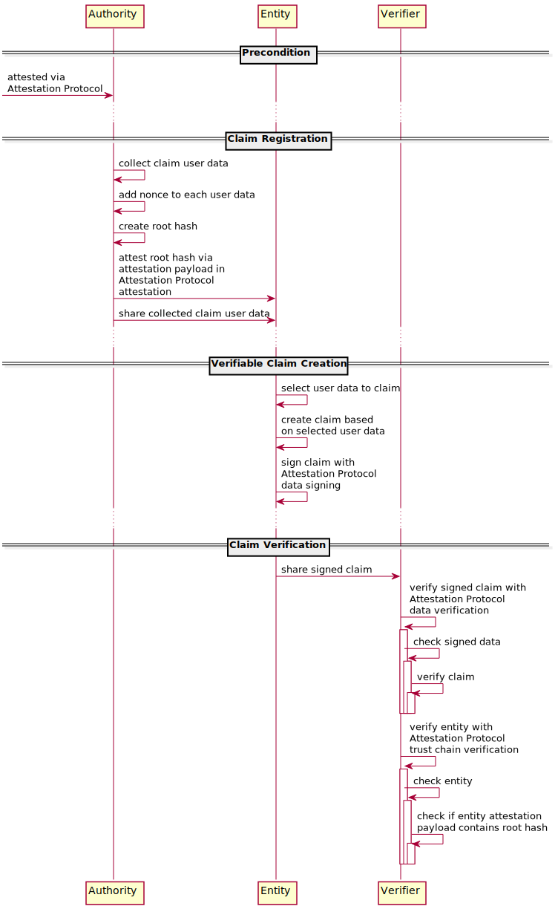

<!-- 
/*
 *  Copyright (C) 2019  Attila Aldemir <a_aldemir@hotmail.de>
 *
 *  This program is free software: you can redistribute it and/or modify
 *  it under the terms of the GNU General Public License as published by
 *  the Free Software Foundation, either version 3 of the License, or
 *  (at your option) any later version.
 *
 *  This program is distributed in the hope that it will be useful,
 *  but WITHOUT ANY WARRANTY; without even the implied warranty of
 *  MERCHANTABILITY or FITNESS FOR A PARTICULAR PURPOSE.  See the
 *  GNU General Public License for more details.
 *
 *  You should have received a copy of the GNU General Public License
 *  along with this program.  If not, see <https://www.gnu.org/licenses/>.
 */ 
 -->

# Table of Contents

- [Table of Contents](#table-of-contents)
    - [Introduction](#introduction)
    - [Claim Elements](#claim-elements)
        - [UserData](#userdata)
        - [Hashes](#hashes)
    - [Authentication Workflows](#authentication-workflows)


## Introduction

The Claim module, in conjunction with the Attestation Protocol, enables the possibility to create [verifiable claims](https://docs.microsoft.com/en-us/previous-versions/msp-n-p/ff359101(v=pandp.10)?redirectedfrom=MSDN), backed by trusted authorities, to fully authenticate an entity to a third party. To do so, a trusted authority signs and stores a fingerprint (hash) of an entity related data set on the blockchain. A verifier can later use this fingerprint to verify the integrity and authenticity of a self-created authentication claim received in an authentication request. A key benefit of only storing the fingerprint instead of the full data set is privacy protection. This approach lets an entity share pieces of attested user data in a way that a verify can validate these pieces without needing to know the full data set.

A claim based authentication system could be built on top of these two modules.


## Claim Elements

A claim object, representing a claim, contains the following elements:

````typescript
// TypeScript notation
interface ClaimObject {
    userData: [
        {
            name: string;
            value: string;
            nonce: string;
        }
    ] | [], // empty array allowed
    hashes: {
        leafHashes: string[];
        rootHash: string;
    }
}
````


### UserData

The userData array contains the clear text user data. Each user data is bundled in an object with the following properties:

| Property |                    Description                    |
|----------|:-------------------------------------------------:|
| name     |                 the user data name                |
| value    |                the user data value                |
| nonce    | a unique, 64 characters long, alphanumeric string |

*user data object properties*

the **name** property contains the name of a user data. It can be a string of any kind. The **value** property contains the actual user data. The **nonce** is needed for unique leaf hash generation.


### Hashes

As described above, an entity/user should be able to create a claim with a subset of one's user data. To achieve this, a [hash tree](https://en.wikipedia.org/wiki/Merkle_tree) based on the user data is created and added to the claim.

To prevent an attacker from recreating the root hash based on collected data, every user data is appended with a unique nonce. This leads to different root hashes even if two user data contain the same name and value.

A flat tree structure with an order of n and a depth of 2 should be used:


*hash tree based on user data with order n and depth 2*

Whenever an entity wants to authenticate itself, it shares the requested user data subset in clear text along with the necessary hashes to recreate the hash tree. A verifier then recreates the hash tree and compares the root hashes to verify the integrity of the shared data.

The hashes object bundles the necessary hashes to recreate the hash tree.

| Property   |              Description              |
|------------|:-------------------------------------:|
| leafHashes | the user data representing hash array |
| rootHash   |    the claim representing root hash   |

*hashes object properties*

The **leafHash** property holds the leaf hashes needed to recreate the root hash. A leaf hash is only included if the corresponding user data is not part of the user data array.

To gain consistency  every property of a user data object is first sorted alphanumeric based on the property key. The values of these properties are then concatenated to a utf8 string and finally hashed with the sha256 hash function.

````typescript
/* User data object */
{
    name: 'user-data-name',
    value: 'user-data-value',
    nonce: 'EnYg7EpDzOSPJM3QVfi0DtKmgwiYX4slAv5zNPmenSXiM5PSPAz03PfNI5C1XEDV'
}


/* 1. Sort keys alphanumerically */
{
    name: 'user-data-name',
    nonce: 'EnYg7EpDzOSPJM3QVfi0DtKmgwiYX4slAv5zNPmenSXiM5PSPAz03PfNI5C1XEDV'
    value: 'user-data-value',
}


/* 2. Concatenate values */
'user-data-nameEnYg7EpDzOSPJM3QVfi0DtKmgwiYX4slAv5zNPmenSXiM5PSPAz03PfNI5C1XEDVuser-data-value'


/* 3. Convert string to utf8 and create leaf hash */
'4add21b3a1ed01e56594a1f32034de55be10d1b5f88dd3e6217a1ae51f344623'
````


The **root hash** property holds the claim representing root hash. It is also generated in a consistency way. After all leaf hashes are available, these hashes will be first, similar to the leaf hash creation, alphanumerically sorted and then concatenated. The resulting concatenation string is then hashed (sha256) and the resulting hash string represents the root hash.

````typescript
/* Leaf hash array */
[
    '4add21b3a1ed01e56594a1f32034de55be10d1b5f88dd3e6217a1ae51f344623',
    '2062f74d687e4d8498116de9ea9a63f89b2b98b5442989c474088d27da618300',
    '783fd6868618d40f86aec0d3468fb15a1aa6464d0bd34eea9478b8d3637becd8',
    'e665592df0614a0c6d837145b94887ed80d450a365a46e93cfed00fca91ac54d',
]


/* 1. Sort leaf hashes alphanumerically */
[
    'e665592df0614a0c6d837145b94887ed80d450a365a46e93cfed00fca91ac54d',
    '2062f74d687e4d8498116de9ea9a63f89b2b98b5442989c474088d27da618300',
    '4add21b3a1ed01e56594a1f32034de55be10d1b5f88dd3e6217a1ae51f344623',
    '783fd6868618d40f86aec0d3468fb15a1aa6464d0bd34eea9478b8d3637becd8',
]


/* 2. Concatenate leaf hashes */
'e665592df0614a0c6d837145b94887ed80d450a365a46e93cfed00fca91ac54d2062f74d687e4d8498116de9ea9a63f89b2b98b5442989c474088d27da6183004add21b3a1ed01e56594a1f32034de55be10d1b5f88dd3e6217a1ae51f344623783fd6868618d40f86aec0d3468fb15a1aa6464d0bd34eea9478b8d3637becd8'


/* 3. Convert string to utf8 and create root hash */
'f35c8ac4a881987e38c84a336d91ff3039eeeac42d8bb5baa9dab6448c64fa46'
````


## Authentication Workflows

There are three major steps for a claim based authentication mechanism: claim registration, claim creation and claim verification.



*claim authentication workflows*


The claim **registration process** registers a claim to an account in the way that an attestor attests an account with the claims root hash as payload. This ensures that a claim is created and / or verified by a trusted entity.

An attested account holder can then **create** verifiable **claims** self sovereignly. To do so, one selects the necessary claim user data, creates the claim and signs it in the way described in the Attestation Protocol. The resulting data set (containing the previously created claim as payload) is a verifiable claim and ready to be shared with a verifier.

To **verify** a verifiable **claim**, one needs to follow the Attestation Protocol verification process with two additionally verification steps. 

The first step is to verify the integrity of a claim. At the point of signed data checking, one needs to extract the previously created claim embedded into the singed data payload, recreate the root hash (based on the claim user data and hashes) and compare it with the claims rootHash value.

The second step needs to be embedded into the entity check process. One simply checks if the claim creator account contains the self-created root hash as payload, which proves that the claim is attested by an attestor account. If the Attestation Protocol verification process finally succeed, the verifier can be sure that the claim is indeed signed by the claim creator account, the claim data are valid and attested by an entity which is itself attested by a trustworthy entity.